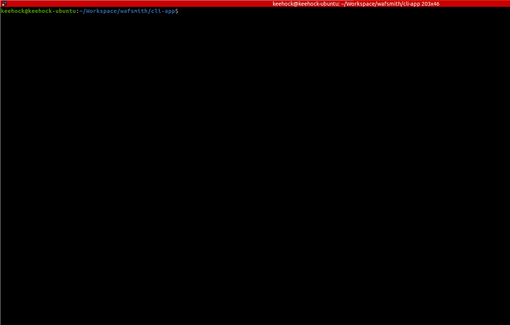
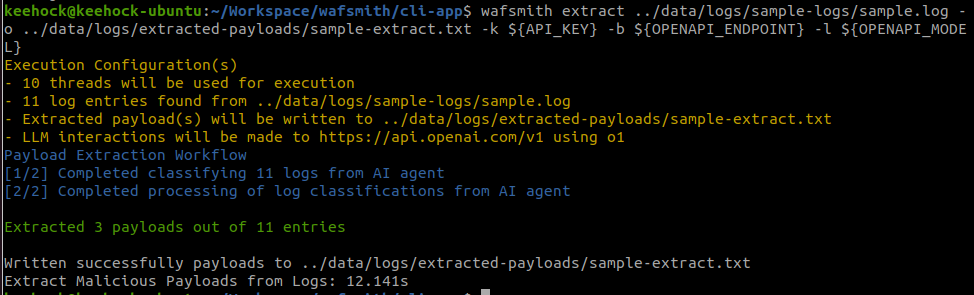
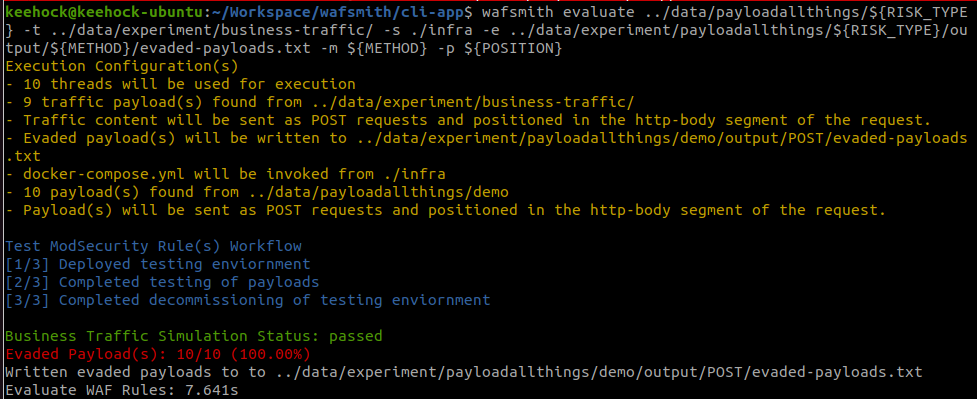
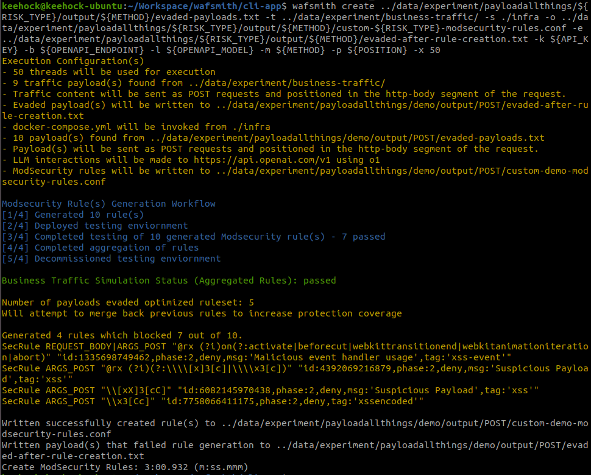
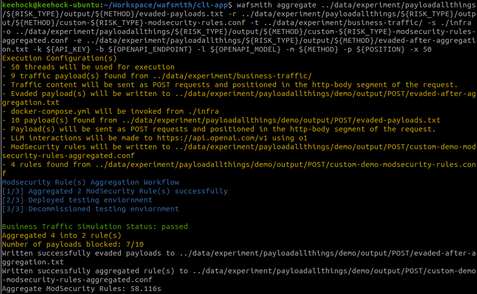

# README

Leveraging on LLM's abilities to mimic cognitive human agents, WAFSmith aims to reduce the friction of WAF rule governance from rule creation to deployment in minutes. It is designed as a highly disruptive tool to augment Blue Team operations in a rapidly evolving threat landscape. It was developed to enhance Blue Team's capabilities to respond to threats in a fast and effective manner, without compromising business operations. The solution is first of the kind, especially in the open source landscape, a novel approach to solve a challenging problem of WAF rule governance.

Whitepaper: https://docs.google.com/document/d/1Uf7WtzsISM9nGY8pc53-eoZa1ce8hNAs9JrMOPFLkX4/edit?usp=sharing

## Setup



### Prerequisites
1. NodeJS (NPM)

``` bash
cd cli-app
npm install -g
```

2. Docker (with compose plugin)

``` bash
cd cli-app/infra
docker compose up
# To check if the docker containers run properly
curl 127.0.0.1 
# expect to see `Hello, World!`
docker compose down
```

### Installation

```bash
git clone https://github.com/tankeehock/wafsmith.git
cd wafsmith/cli-app
npm install
npm install -g
```

## Usage

``` bash
wafsmith -h

Usage: wafsmith [options] [command]

WAFSmith: LLM based WAF Rule Creation Framework

Options:
  -V, --version                           output the version number
  -h, --help                              display help for command

Commands:
  create [options] <input>                Create ModSecurity Rules
  evaluate [options] <payload-directory>  Evaluate deployed WAF rules against a list of payloads
  extract [options] <input>               Extract payload(s) from logs
  aggregate [options] <input>             Optimizing ModSecurity Rules
  help [command]                          display help for command
```

### extract


``` bash
wafsmith extract -h

Usage: wafsmith extract [options] <input>

Extract payload(s) from logs

Arguments:
  input                       Input directory / file containing the Nginx log files

Options:
  -o, --output <output-file>  Specify the output file for the newly generated rule(s) if any
  -k, --api-key <key>         OpenAI API Key
  -b, --base-url <base>       OpenAI SDK Endpoint
  -l, --model <model>         OpenAI Model
  -x, --threads <threads>     Specify the number of threads to be used during the rule generation
                              process. Default is 10 (default: 10)
  -h, --help                  display help for command
```




### evaluate

``` bash
wafsmith evaluate -h

Usage: wafsmith evaluate [options] <payload-directory>

Evaluate deployed WAF rules against a list of payloads

Arguments:
  payload-directory              Input directory / file containing the payloads

Options:
  -e, --evaded <evaded-file>     Specify the output file for evaded payload(s) if any
  -s, --setup <setup-directory>  Specify the directory which contains the docker compose enviornment
                                 setup
  -t, --traffic <traffic>        Specify directory / file containing business traffic content for
                                 simulation
  -p, --position <position>      Specify the postion of the payload in the HTTP request. Default is
                                 url-parameters (default: "url-parameters")
  -m, --method <method>          Specify the HTTP method for the payload. Default is GET. (default:
                                 "GET")
  -x, --threads <threads>        Specify the number of threads to be used during the rule generation
                                 process. Default is 10 (default: 10)
  -h, --help                     display help for command
```



### create

``` bash
wafsmith create -h

Usage: wafsmith create [options] <input>

Create ModSecurity Rules

Arguments:
  input                          Input directory / file containing the payloads

Options:
  -o, --output <output-file>     Specify the output file for the newly generated rule(s) if any
  -e, --evaded <evaded-file>     Specify the output file for evaded payload(s) if any
  -s, --setup <setup-directory>  Specify the directory which contains the docker compose enviornment
                                 setup
  -t, --traffic <traffic>        Specify directory / file containing business traffic content for
                                 simulation
  -k, --api-key <key>            OpenAI API Key
  -b, --base-url <base>          OpenAI SDK Endpoint
  -l, --model <model>            OpenAI Model
  -p, --position <position>      Specify the postion of the payload in the HTTP request. Default is
                                 url-parameters (default: "url-parameters")
  -m, --method <method>          Specify the HTTP method for the payload. Default is GET. (default:
                                 "GET")
  -x, --threads <threads>        Specify the number of threads to be used during the rule generation
                                 process. Default is 10 (default: 10)
  -h, --help                     display help for command

```



### aggregate

``` bash
wafsmith aggregate -h

Usage: wafsmith aggregate [options] <input>

Optimizing ModSecurity Rules

Arguments:
  input                          Input directory / file containing the list of payloads that the
                                 rules will are designed to catch

Options:
  -r, --rules <rules>            Input directory / file containing the list of rules that will be
                                 aggregated
  -o, --output <output-file>     Specify the output file for the newly generated rule(s) if any
  -e, --evaded <evaded-file>     Specify the output file for evaded payload(s) if any
  -s, --setup <setup-directory>  Specify the directory which contains the docker compose enviornment
                                 setup
  -t, --traffic <traffic>        Specify directory / file containing business traffic content for
                                 simulation
  -k, --api-key <key>            OpenAI API Key
  -b, --base-url <base>          OpenAI SDK Endpoint
  -l, --model <model>            OpenAI Model
  -p, --position <position>      Specify the postion of the payload in the HTTP request. Default is
                                 url-parameters (default: "url-parameters")
  -m, --method <method>          Specify the HTTP method for the payload. Default is GET. (default:
                                 "GET")
  -x, --threads <threads>        Specify the number of threads to be used during the rule generation
                                 process. Default is 10 (default: 10)
  -h, --help                     display help for command
```



### Sample Usage

Modify the `experiment.bash` or the variables below and execute them.

__Please ensure that you are in the ./cli-app directory when using the `demo` commands / script.__

1. Invokes `Evaluate` > `Create` workflows 

``` bash
# cd ./cli-app
export OPENAPI_ENDPOINT="hello-world"
export OPENAPI_MODEL="hello-world"
export API_KEY="hello-world"

export RISK_TYPE="demo"
export METHOD="POST"
export POSITION="http-body"

# evaluate
wafsmith evaluate ../data/payloadallthings/${RISK_TYPE} -t ../data/experiment/business-traffic/ -s ./infra -e ../data/experiment/payloadallthings/${RISK_TYPE}/output/${METHOD}/evaded-payloads.txt -m ${METHOD} -p ${POSITION}

wafsmith create ../data/experiment/payloadallthings/${RISK_TYPE}/output/${METHOD}/evaded-payloads.txt -t ../data/experiment/business-traffic/ -s ./infra -o ../data/experiment/payloadallthings/${RISK_TYPE}/output/${METHOD}/custom-${RISK_TYPE}-modsecurity-rules.conf -e ../data/experiment/payloadallthings/${RISK_TYPE}/output/${METHOD}/evaded-after-rule-creation.txt -k ${API_KEY} -b ${OPENAPI_ENDPOINT} -l ${OPENAPI_MODEL} -m ${METHOD} -p ${POSITION} -x 50

# move the generated rules over to the rules folder
cp ../data/experiment/payloadallthings/${RISK_TYPE}/output/${METHOD}/custom-${RISK_TYPE}-modsecurity-rules.conf ./infra/rules/custom-${RISK_TYPE}-modsecurity-rules.conf

wafsmith evaluate ../data/payloadallthings/${RISK_TYPE} -t ../data/experiment/business-traffic/ -s ./infra -e ../data/experiment/payloadallthings/${RISK_TYPE}/output/${METHOD}/evaded-payloads-after-rules-creation.txt -m ${METHOD} -p ${POSITION}

# remove the rules after testing
rm ./infra/rules/custom-${RISK_TYPE}-modsecurity-rules.conf
```

2. Invoke `Extract` Workflow

``` bash
# extract
wafsmith extract ../data/logs/sample-logs/sample.log -o ../data/logs/extracted-payloads/sample-extract.txt -k ${API_KEY} -b ${OPENAPI_ENDPOINT} -l ${OPENAPI_MODEL}
```

3. Invoke `Aggregate` Workflow

``` bash
# aggregate
wafsmith aggregate ../data/experiment/payloadallthings/${RISK_TYPE}/output/${METHOD}/evaded-payloads.txt -r ../data/experiment/payloadallthings/${RISK_TYPE}/output/${METHOD}/custom-${RISK_TYPE}-modsecurity-rules.conf -t ../data/experiment/business-traffic/ -s ./infra -o ../data/experiment/payloadallthings/${RISK_TYPE}/output/${METHOD}/custom-${RISK_TYPE}-modsecurity-rules-aggregated.conf -e ../data/experiment/payloadallthings/${RISK_TYPE}/output/${METHOD}/evaded-after-aggregation.txt -k ${API_KEY} -b ${OPENAPI_ENDPOINT} -l ${OPENAPI_MODEL} -m ${METHOD} -p ${POSITION} -x 50
```

4. Invoke `extract` Workflow

``` bash
# extract
wafsmith extract ../data/logs/sample-logs/xss-sample-50.log -o ../data/logs/extracted-payloads/xss-sample-50.txt -k ${API_KEY} -b ${OPENAPI_ENDPOINT} -l ${OPENAPI_MODEL}
```

## Troubleshoot

1. Issues with Docker persmissions  
Depending on how your Docker is installed, `wafsmith` might have issues trying to instantiate the docker containers. As such, these entries in the in the docker compose file has been commented out. If you want to access the log files, do ensure that you can mount the folders from your docker. 

``` bash
./modsecurity/modsecurity.conf:/etc/modsecurity.d/modsecurity.conf
./nginx/logs:/var/log/nginx
```